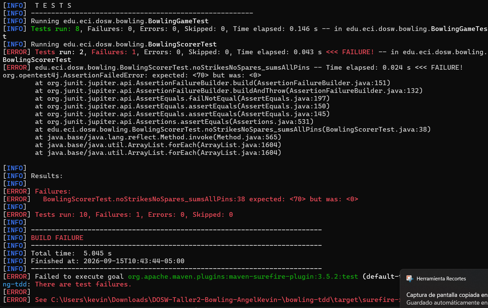
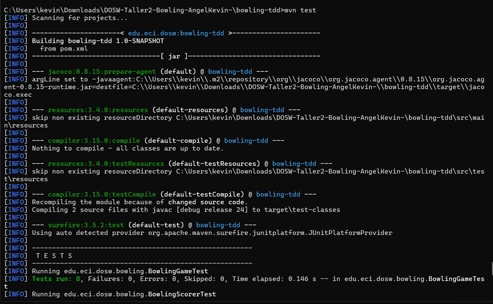
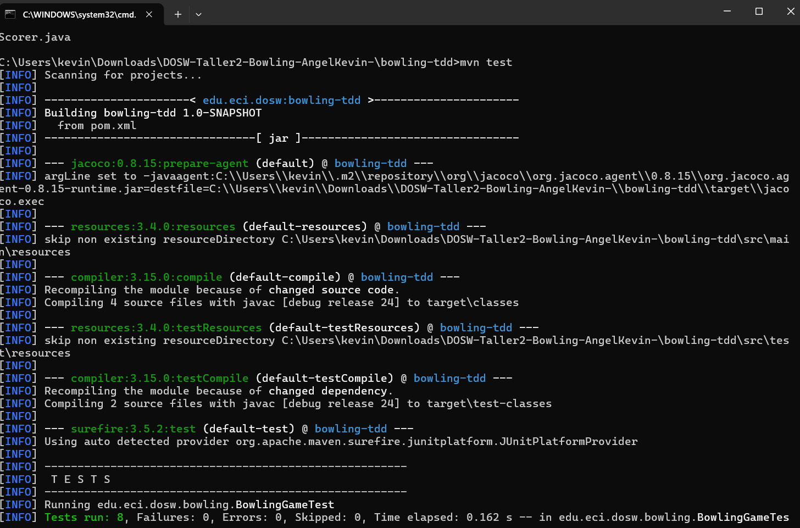
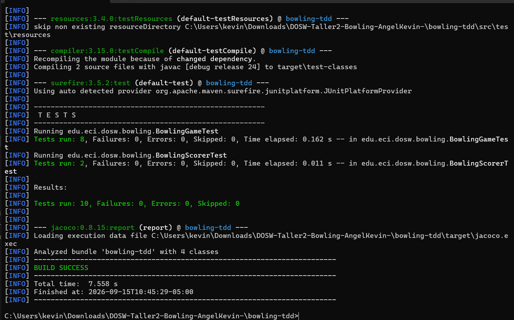
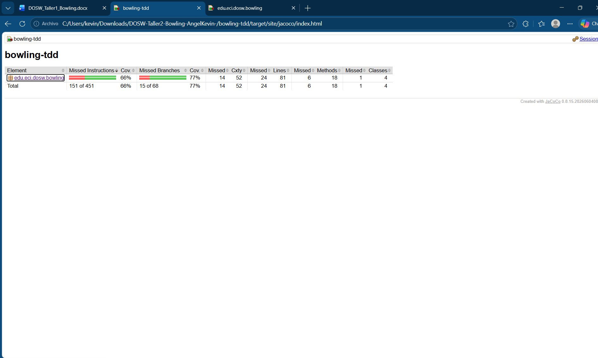
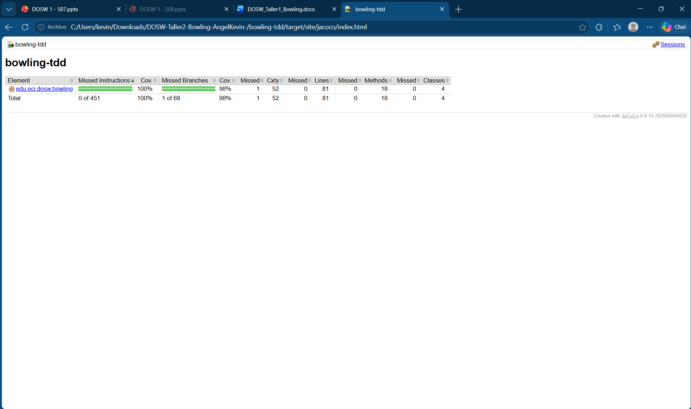
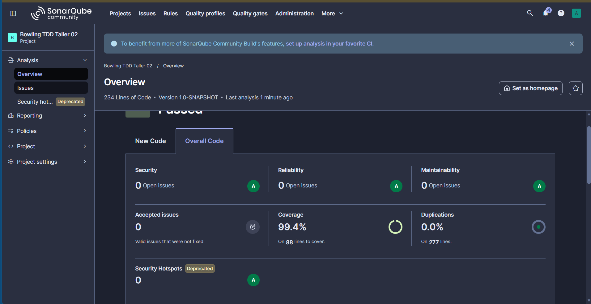
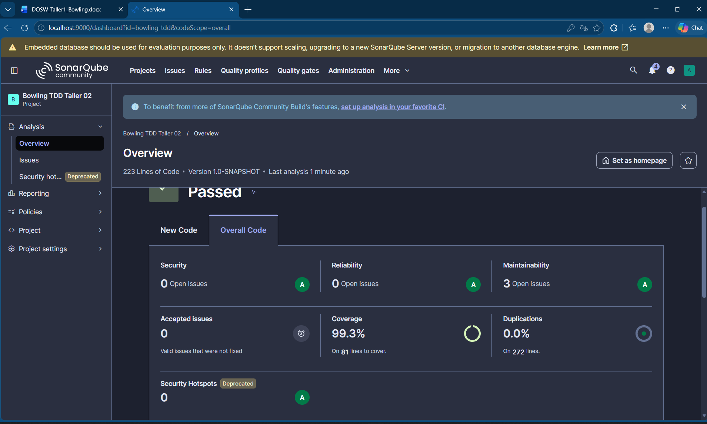

# BowlTech

## 1\. Identificación

- Nombre completo: Angel Kevin
- Código estudiantil: 1000098372
- Correo institucional: kevin.angel-a@mail.escuelaing.edu.co

## 2\. Descripción

BowlTech es el motor que calcula el puntaje de una partida de bowling (10 pines). Recibe los tiros uno por uno y al final entrega el puntaje total aplicando las reglas reales del juego: si sumas 10 pinos entre los dos tiros de un frame es spare y el siguiente tiro cuenta doble; si tumbas los 10 pinos de una sola vez es strike y los dos tiros siguientes cuentan como bono; y el frame 10 es especial porque si haces spare o strike ahí te dan un tiro (o dos) extra para poder cobrar el bono.

Las clases se dividen así:

- `FrameType`\: solo dice en qué estado va un frame (normal, spare, strike o el frame 10).
- `Frame`\: guarda los tiros de un frame y sabe decir si ya se llenó.
- `BowlingGame`\: es la que recibe cada tiro, revisa que sea válido, decide cuándo pasar al siguiente frame y marca cuándo el juego terminó.
- `BowlingScorer`\: se encarga solo de sumar el puntaje final, mirando los tiros y aplicando los bonos de spare y strike.

## 3\. Evidencia TDD

Cada funcionalidad se hizo primero escribiendo el test (que falla, RED), después el código mínimo para que pase (GREEN) y luego se refactorizaba si hacía falta. Cada fase quedó en un commit aparte (`test: RED - ...`, `feat: GREEN - ...`, `refactor: ...`). En total quedaron 22 tests, todos pasando.

### Ciclo documentado como ejemplo (caso: juego sin strikes ni spares)

Test `noStrikesNoSpares_sumsAllPins`\: un juego sin ningún strike ni spare debe sumar directamente todos los pinos derribados (10 frames de 3\+4 \= 70 puntos).

**RED** — se rompió temporalmente el cálculo del bono de strike en `BowlingScorer`, y el test falló (`expected: <70> but was: <0>`, `BUILD FAILURE`):

**GREEN** — al revertir el cambio, los 22 tests vuelven a pasar (`Tests run: 22, Failures: 0`, `BUILD SUCCESS`):

**REFACTOR** — posteriormente, el método `roll()` de `BowlingGame` se refactorizó (ver sección de SonarQube) sin afectar el resultado de estos tests.

## 4\. JaCoCo

**Antes** — cobertura de 70%, por debajo del mínimo exigido (85%), build en rojo:

**Después** — 99.4% de cobertura, build en verde:

Las pruebas que más subieron la cobertura fueron las de `BowlingScorerTest`, porque son las que recorren todas las combinaciones del cálculo de puntaje (spare, strike, strikes seguidos, juego perfecto), que es la parte del código con más caminos posibles.

## 5\. SonarQube

Resultado final — Quality Gate en Passed, 99.4% de cobertura, 0% de duplicación y 0 issues abiertos:

Al principio salieron 3 issues (el método `roll()` estaba muy complejo, había un campo que no se usaba para nada, y un test usaba una lambda donde cabía mejor una referencia a método). Los tres se corrigieron:

## 6\. Pull Requests

| Enlace al PR | Fecha de merge | Módulo que cubre |
| --- | --- | --- |
| \[enlace al PR\] | \[fecha\] | Implementación completa de BowlTech (dominio, motor de juego, cálculo de puntaje, tests, JaCoCo y SonarQube) |

## 7\. Reflexión

**¿Qué caso edge fue el más difícil de implementar con TDD y por qué?**

El frame 10, sin duda. Es el único que no se comporta como los demás: si haces strike o spare ahí, te ganas un tiro extra (o dos), pero si no, se cierra igual que cualquier otro frame con dos tiros. Me costó porque tocó meter una condición aparte solo para ese frame dentro de `Frame.isFull()`, y necesité varios tests para ir cubriendo cada combinación (strike con dos bonos, spare con uno, frame normal). Ir test por test ayudó a no intentar adivinar toda la lógica de una sola vez.

**¿Qué parte del código cambió durante REFACTOR sin modificar el comportamiento observable?**

El método `roll()` de `BowlingGame` se partió en tres métodos más pequeños, cada uno haciendo una sola cosa (crear el frame si hace falta, validar el segundo tiro, actualizar si es spare o strike). También se borró un campo que sobraba (`currentFrame`, nunca se leía) y se cambió una lambda por una referencia a método en un test. Los 22 tests siguieron pasando exactamente igual antes y después.

**¿Qué casos de prueba descubriste al revisar el reporte de cobertura de JaCoCo que no habías considerado antes?**

En realidad no aparecieron huecos nuevos: el reporte mostró 100% de líneas y 98% de ramas cubiertas solo con los 22 casos que pedía el taller. Lo que sí me sirvió fue confirmar que cosas como la validación de pinos fuera de rango o la excepción al pedir el puntaje de un juego incompleto ya estaban probadas, sin haberlo notado tan claramente antes de ver el reporte.

**¿Qué hallazgo de SonarQube produjo un cambio real en el código?**

El de la complejidad del método `roll()`. Los otros dos (el campo sin usar y la lambda) fueron correcciones casi cosméticas, pero este sí me hizo repensar cómo estaba organizado el método más importante del juego y separarlo en partes más claras.
